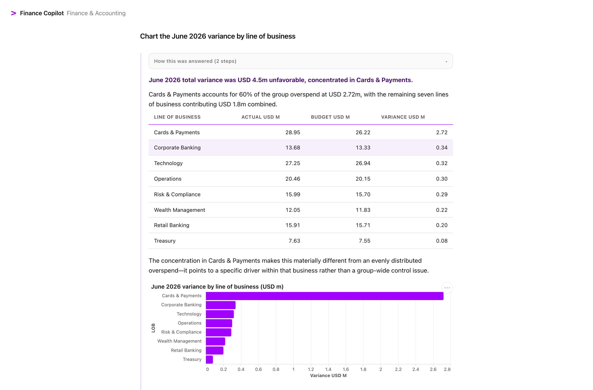
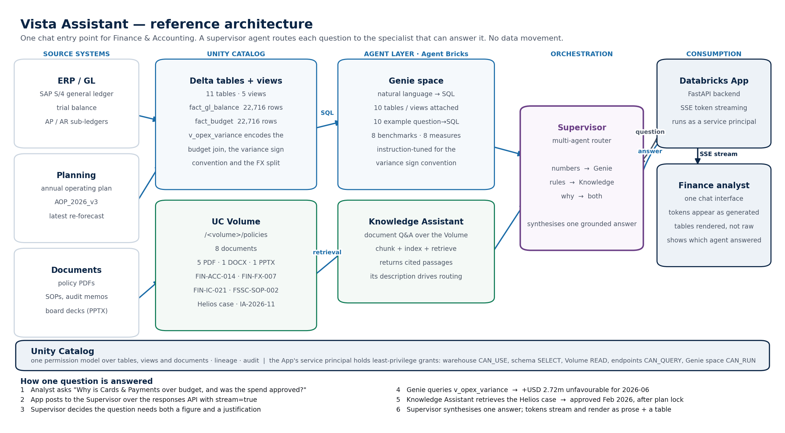

# Vista Assistant

**One chat entry point for Finance & Accounting questions, answered from structured data,
policy documents, or both.**

A working Databricks demo: an **Agent Bricks Supervisor** decides, per question, whether to
query **Genie** (the ledger, budget, accruals, payables, close tracker), search a
**Knowledge Assistant** (accounting policies, SOPs, audit memos, board packs), or use both —
then renders **Vega-Lite charts** through a Unity Catalog function and streams the answer to
a chat UI.



---

## The problem this addresses

An analyst in a bank's finance shared-services centre answering *"why did Cards opex overrun
in June, and was it approved?"* needs the GL trial balance, the budget file, the accrual
register, the payables aging and the close tracker — **plus** the accrual policy PDF, the
project business case, an audit memo and last quarter's board pack.

The data dependency is spread across systems and formats, so most of the effort goes into
*finding* things rather than analysing them, and two analysts often reach two different
answers.

## What it does

| Ask | Routed to | You get |
|---|---|---|
| "Which line of business overspent the most in June?" | the finance data | a ranked table with the drivers |
| "What must happen to an accrual open over 90 days?" | the policy documents | the rule, cited to document and page |
| "Why is Cards & Payments over budget, and was it approved?" | **both** | the figure **and** the approval that explains it |
| "Chart the June variance by line of business" | data + chart function | an interactive Vega-Lite chart |

Every answer carries a **Sources** panel (document name, page, the quoted clause) and a
collapsible **"How this was answered"** trace, so nothing is a black box.

## Architecture

```
Browser (SSE)  →  Databricks App (FastAPI)  →  Agent Bricks Supervisor
                                                ├── Genie space         → Delta tables & views
                                                ├── Knowledge Assistant → UC Volume (documents)
                                                └── UC function         → Vega-Lite chart spec
                              everything governed by Unity Catalog
```



## Get started

Two prerequisites: a Databricks workspace with **Agent Bricks** and **Databricks Apps**
enabled, and a SQL warehouse.

```bash
git clone https://github.com/akashsuresh-db/vista-assistant.git
cd vista-assistant
pip install -r requirements.txt

cp config.example.yaml config.yaml   # then edit: profile, warehouse_id, catalog
python setup.py                      # builds everything that can be automated
```

`setup.py` provisions the schema and Volume, generates the datasets, builds 11 Delta tables
and 5 views, renders and uploads 8 policy documents, creates the Genie space and the chart
function, then **pauses** at the two steps Agent Bricks cannot automate and tells you exactly
what to click.

Full walkthrough with screenshots: **[docs/SETUP.md](docs/SETUP.md)**

```bash
python setup.py --status   # what is done, what is next
python setup.py --list     # every step
```

## The demo scenario

**Meridian Bank** — 5 legal entities, 8 lines of business, 38 cost centres, 18 months of
ledger history. Six analytical stories are planted in the data *and* corroborated by the
documents, so every cross-source answer is verifiable:

| # | Story | The point |
|---|-------|-----------|
| 1 | Cards & Payments +2.72m technology overrun | Looks like overspend; was **approved** just after the plan locked |
| 2 | EMEA FX headwind | +798k unfavourable in USD but only +107k real — **691k is currency translation** |
| 3 | Intercompany break, 482k, two periods | Breaches the one-period escalation rule |
| 4 | 6 accruals over 90 days, 1.34m | Breaches accrual policy FIN-ACC-014 |
| 5 | 3 close SLA breaches | Two teams affected |
| 6 | Disputed vendor exposure 1.31m | Rate-card dispute tied to story 1 |

Stories 1 and 2 are the interesting ones: in both, **the naive answer is wrong**. That is what
makes the multi-agent routing worth demonstrating rather than just asserting.

## What is worth stealing from this repo

**Views carry the analytics, not the prompt.** `v_opex_variance` pre-joins actuals to budget
and fixes the variance sign convention (positive = overspend) and the FX decomposition. A
text-to-SQL model asked to *derive* these gets them wrong; asked to *look them up*, it gets
them right.

**The FX split is explicit**, because the reported number misleads:

```
total USD variance = constant-currency variance + FX translation impact
  constant-currency = (actual_local − budget_local) × plan_rate
  FX impact         = actual_local × (actual_rate − plan_rate)
```

**Charts come from a UC function, not model-authored JSON.** `make_chart` builds a valid
Vega-Lite v6 spec in Python: field types are inferred, money strings are coerced, long
category names flip to horizontal bars, and it is a governed UC object with EXECUTE grants
rather than prompt text.

**The answer is separated from the working.** A supervisor stream interleaves routing
narration, each sub-agent's raw reply, and the final synthesis. Only the last is shown; the
rest goes to the trace tile. See the comments in
[`app/backend/supervisor.py`](app/backend/supervisor.py) — that classification took several
attempts to get right.

## Tests

```bash
python tests/test_streaming.py                  # SSE + trace + markdown (no workspace needed)
python tests/test_docs_content.py               # the documents really contain the figures
python scripts/verify_local.py                  # the planted stories are present and dominant
python tests/test_charts.py                     # chart specs + rendering  (needs a workspace)
python tests/test_genie.py                      # Genie answers correctly  (needs a workspace)
python tests/test_ka.py                         # retrieval reaches every document
python tests/test_supervisor.py                 # routing + no internal names leak
```

Suites that need a live agent **skip with a message** when the relevant endpoint is not yet
configured, rather than failing.

## Gotchas this repo already handles

- `read_files` with `inferSchema` turns `period` into DATE and `gl_account` into INT — use
  `schemaHints`, or Genie renders `2026-06-01` and joins break.
- The Genie spaces API rejects the payload unless **every collection is sorted by id**, with
  the unhelpful error `Invalid export proto`.
- **`CREATE OR REPLACE FUNCTION` drops its grants.** If a UC function is wired to an agent,
  the agent then fails *every* request with "Failed to register UC function tool" — so the
  grants live in the same SQL file that creates it.
- A UC function's result arrives as a `function_call_output` item, **not** as streamed text
  deltas like a sub-agent's reply.
- SSE behind the Apps proxy needs `X-Accel-Buffering: no`, or the whole response is buffered.
- Do not put `max-width: 100%` on a Vega canvas, and do not validate a browser chart layout
  with an offline rasteriser at a fixed width — the bug only appears at `width: "container"`.

## Cost

Serverless SQL for the build (minutes), pay-per-token for the agents, and an always-on
Databricks App. The App is the main idle cost — stop it when not demoing. Note that Knowledge
Assistant and Supervisor each provision a Vector Search endpoint, which does **not** scale to
zero; delete the agents to release them.

## Repo layout

```
setup.py                    one-command setup, resumable
config.example.yaml         copy to config.yaml and edit
scripts/config.py           the single source of workspace configuration
scripts/gen_structured.py   generates the marts (seeded, reproducible)
scripts/docs_content/       the 8 fictional finance documents
sql/01_tables.sql           tables, fully commented for Genie
sql/02_views.sql            the variance/FX analytics
sql/03_vegalite_function.sql the chart function (and its grants)
app/                        FastAPI + a dependency-free chat UI
docs/SETUP.md               step-by-step with screenshots
```

## Licence

MIT. The data, documents, bank and figures are **entirely synthetic**.
