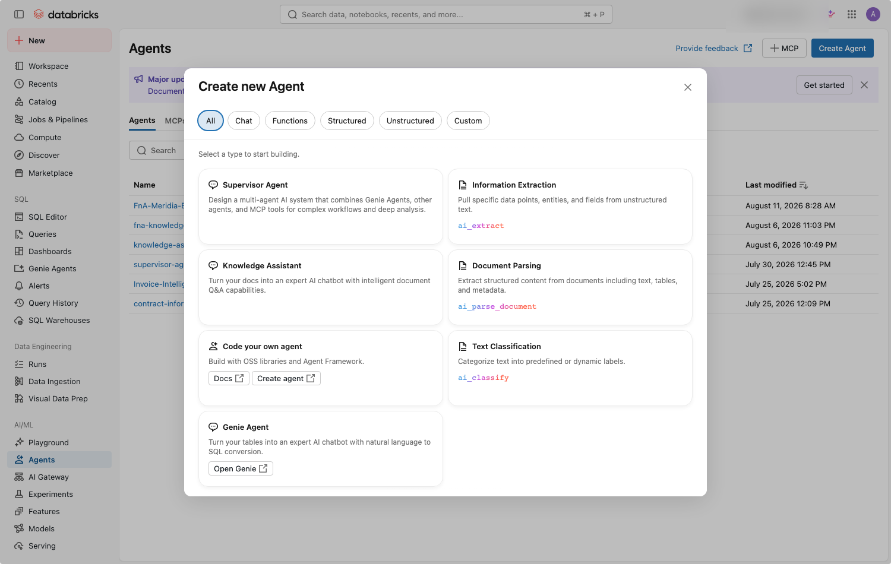
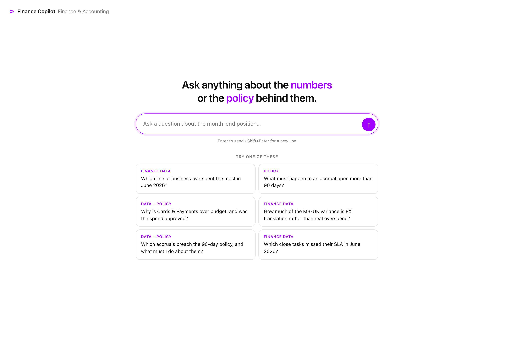
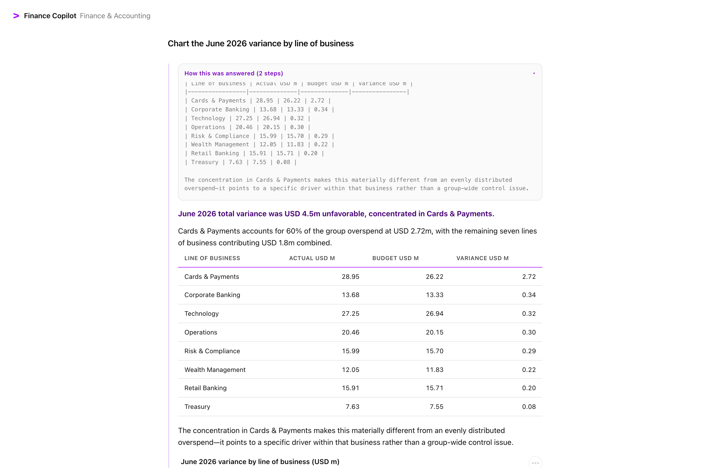

# Setting up Vista Assistant

Start to finish this takes about **35 minutes**, most of it waiting for the Knowledge
Assistant to index the documents.

Nine of the eleven steps are scripted. Two are not, because Agent Bricks has no create API
for the Knowledge Assistant or the Supervisor Agent — those are click-by-click below.

---

## Before you start

| Requirement | How to check |
|---|---|
| A Databricks workspace with **Agent Bricks** | left nav shows **Agents** |
| **Databricks Apps** enabled | left nav shows **Apps** under Compute |
| A **SQL warehouse** (serverless is fine) | `databricks warehouses list -p <profile>` |
| `CREATE SCHEMA` on a catalog, and `CREATE VOLUME` | ask your metastore admin if unsure |
| Databricks CLI ≥ 0.240 | `databricks --version` |
| Python 3.10+ | `python --version` |

```bash
git clone https://github.com/akashsuresh-db/vista-assistant.git
cd vista-assistant
pip install -r requirements.txt
databricks auth login --profile my-workspace
```

## Step 0 — configure

```bash
cp config.example.yaml config.yaml
```

Edit `config.yaml` and set at minimum:

```yaml
profile: my-workspace       # your CLI profile name
warehouse_id: abc123...     # SQL Warehouses → your warehouse → Connection details
catalog: main               # a catalog you can create a schema in
schema: vista_assistant     # created for you
```

Check it resolved:

```bash
python setup.py --status
```

> `config.yaml` is gitignored. Nothing about your workspace is ever committed.

---

## Steps 1–6 — the scripted part

```bash
python setup.py
```

That runs, in order:

| Step | What it does |
|---|---|
| `check` | verifies CLI, auth, warehouse, python packages |
| `uc` | creates the schema and the documents Volume |
| `data` | generates 11 datasets and verifies the planted stories (12/12 checks) |
| `tables` | uploads the CSVs, builds 11 Delta tables + 5 views, removes the staging files |
| `docs` | renders 8 policy documents and uploads them to the Volume |
| `chart-fn` | creates the `make_chart` Vega-Lite function **and its grants** |
| `genie` | creates the Genie space and **writes its id into `config.yaml`** |

It then **stops** and prints the instructions for the next step. Everything is idempotent —
re-run `python setup.py` as often as you like; finished steps are skipped.

**Verify:** in Catalog Explorer you should see 11 tables, 5 views, and 8 files under
`/Volumes/<catalog>/<schema>/<volume>/policies`.

---

## Step 6 — create the Knowledge Assistant *(manual, ~3 min + indexing)*

**Agents → Create Agent → Knowledge Assistant**



| Field | Value |
|---|---|
| **Name** | `vista-knowledge-assistant` |
| **Knowledge source → Type** | Files in a Volume |
| **Source** | `/Volumes/<catalog>/<schema>/<volume>/policies` |
| **Source name** | `finance-policies` |

**Description** — this is what the Supervisor reads to decide when to route here, so it must
enumerate the documents:

```
Answers questions about Meridian Bank finance policies, month-end close procedures,
accounting standards, internal audit findings and management reporting commentary. Covers
the accruals and provisions policy FIN-ACC-014 including the 90-day accrual rule, the
foreign currency translation policy FIN-FX-007 covering constant-currency reporting, the
intercompany reconciliation standard FIN-IC-021 covering break materiality and escalation,
the month-end close SOP FSSC-SOP-002 with the close calendar and SLAs, the Project Helios
business case explaining the Cards & Payments technology spend approval, internal audit memo
IA-2026-11 on aged accruals, the Q2 2026 board MD&A pack, and the June 2026 variance
commentary pack.
```

**Describe the content** (on the knowledge source itself):

```
Meridian Bank Group Finance documents: accruals and provisions policy FIN-ACC-014 with the
90-day accrual rule and materiality thresholds; foreign currency translation policy
FIN-FX-007 covering plan-rate versus actual-rate translation and constant-currency variance;
intercompany reconciliation standard FIN-IC-021 with break materiality and escalation
thresholds; month-end close SOP FSSC-SOP-002 with the business-day close calendar and SLAs;
the Project Helios business case approving the card platform cloud migration spend; internal
audit memo IA-2026-11 on aged accrual governance; the Q2 2026 board MD&A pack; and the June
2026 variance commentary pack.
```

Click **Create Agent**, then wait for indexing. The UI shows *"Finalizing processing…"*.

> **Watch out:** the serving endpoint reports `READY` **before** indexing has finished. Only
> the "Last sync" timestamp in the Sources tab tells you it is really done. If you test too
> early the agent answers *"I don't have any search results"* — that is not a failure, just
> wait.

Copy the endpoint name (`ka-xxxxxxxx-endpoint`) into `config.yaml`:

```yaml
ka_endpoint: "ka-xxxxxxxx-endpoint"
```

**Verify:**

```bash
python tests/test_ka.py     # expect 10/10 retrieval cases to pass
```

---

## Step 7 — create the Supervisor Agent *(manual, ~5 min)*

**Agents → Create Agent → Supervisor Agent**

Name it `vista-supervisor`, then attach **three** things:

| Attach | Which |
|---|---|
| Genie space | the one setup created — id is in your `config.yaml` |
| Knowledge Assistant | `vista-knowledge-assistant` from step 6 |
| **UC Function** tool | `<catalog>.<schema>.make_chart` |

> The chart function can be attached either as a **UC Function** tool (simplest) or as an
> **MCP** tool pointing at
> `https://<your-workspace>/api/2.0/mcp/functions/<catalog>/<schema>`.
> Both work; UC Function is one less moving part.

**Description:**

```
Single entry point for Meridian Bank Finance & Accounting questions. Routes quantitative
questions about GL actuals, budget variance, FX impact, accruals, payables, intercompany
balances, close SLAs and headcount to the finance data agent, and routes questions about
policy, procedure, approval, governance and management commentary to the finance knowledge
assistant. Combines both when a question needs a number and its explanation.
```

**Instructions** — paste all of this. Each rule exists because the agent got something wrong
without it:

```
You serve finance analysts and controllers in a bank's shared-services centre. The latest
closed accounting period is 2026-06 and Group reports in USD.

ROUTING
- Numbers, balances, variances, counts, trends, rankings, aging, cost centres, entities,
  periods -> the finance data agent.
- Rules, thresholds, procedures, the close calendar, approvals, audit findings, board
  commentary -> the policy documents agent.
- Any question that asks WHY something happened, whether something was ALLOWED or
  APPROVED, or what you should DO about a number -> query BOTH and synthesise one answer.
  A figure without its governing rule, or a rule without the figure it applies to, is only
  half an answer.

ALWAYS STATE THE BASIS OF THE ANSWER
- Name the period you used. If the question did not specify one, use 2026-06 and say so.
- State the currency, and whether a variance is reported USD or constant currency.
- Name the entity, LOB or cost centre filter you applied.
- When a rule determines the answer, cite the document AND the specific section or clause,
  for example "FIN-ACC-014 section 4, the 90-day rule". An analyst has to defend this to an
  auditor, so a bare policy number is not enough.

"WHAT DROVE IT" MEANS SHOW THE LINE ITEMS FIRST
When the user asks what DROVE, CAUSED or EXPLAINS a variance, begin with the numeric
breakdown from the finance data - the specific GL accounts and cost centres with their
individual variance amounts, largest first - and only then give the business narrative or the
approving document. Do not replace the line items with the story.

NEVER GIVE A BARE TOTAL
A single number invites the question "where?". Whenever a figure would collapse to one row -
total overspend, full-year forecast versus plan, total exposure - also show the breakdown by
line of business (and by cost centre if the user named an LOB or entity), largest first.
Concentration is usually the real finding.

RANK BY MATERIALITY AND GROUP RELATED ITEMS
- Consolidate items that are one underlying issue. Four disputed invoices from the same
  vendor on the same root cause are ONE exposure, not four.
- Order by materiality, and say what makes each one material.
- Distinguish a control failure from an evidence-quality issue. A controller sequences work
  differently for each.

CHARTS
When a numeric answer would read better as a picture - a trend across periods, a ranking of
cost centres or lines of business, a comparison such as reported versus constant currency -
call the make_chart tool as well as giving the figures.
- Pass the rows you already retrieved. Never invent data for a chart.
- line or area for a trend over time, bar to compare or rank categories, point to relate two
  measures, pie only for parts of a single whole.
- Write a title including the unit, e.g. "Cards & Payments variance by month, 2026 (USD m)".
- Use series_field only when there is genuinely a second dimension; otherwise pass "".
- Do NOT use the sandbox or write Python/matplotlib to draw charts, and do not paste the
  returned specification into your answer.

SEPARATE FACT FROM JUDGEMENT
- Give the figures and the rule as facts.
- Label any interpretation as an interpretation and give the evidence.
- Do not forecast beyond 2026-06 and do not invent a metric that is not in the data.

NEVER DEAD-END A QUESTION
If you cannot answer as asked, say why in one line, then offer the nearest thing you CAN do.
Asked for a future period: the ledger ends 2026-06, but offer the latest forecast on record
or the year-to-date run rate. Asked for a personnel or legal decision: say that is outside
what you can advise on, then offer the cost-driver analysis that would inform it.

STYLE
- Lead with the answer in one or two sentences, then the supporting detail.
- Use a markdown table for anything with more than two rows. Right-align money.
- Never mention Genie, Knowledge Assistant, Agent Bricks, Databricks, serving endpoints, SQL,
  or any internal tool or table name. Say "the finance data" and "the policy documents".
- Do NOT narrate your own process. Never write "I'll query...", "Let me check...". Emit only
  the finished answer.
```

> **UI gotcha:** typing into the Instructions field with automation can leave **Save**
> disabled. Click into the field and type a character to fire the change event. The Supervisor
> autosaves ("Last saved Ns ago").

Copy the endpoint name (`mas-xxxxxxxx-endpoint`) into `config.yaml`:

```yaml
supervisor_endpoint: "mas-xxxxxxxx-endpoint"
```

**Verify:**

```bash
python tests/test_supervisor.py    # 10 routing cases
```

---

## Steps 8–9 — deploy and verify

```bash
python setup.py            # picks up where it left off: deploys the App
python setup.py --step verify
```

The deploy prints the App URL. Open it:



Ask one of the starter questions. A data question returns a table and a chart; expanding
**"How this was answered"** shows which specialists were used:



---

## Try these

| Question | Expect |
|---|---|
| Which line of business overspent the most in June 2026? | Cards & Payments, **+2.72m**, full LOB breakdown |
| What must happen to an accrual open more than 90 days? | FIN-ACC-014, the 90-day rule, cited to page |
| Why is Cards & Payments over budget, and was the spend approved? | **both** sources: the figure **and** the Feb-2026 approval |
| How much of the MB-UK variance is FX translation? | +798k reported, **+107k** real, 691k currency |
| Chart the June 2026 variance by line of business | horizontal bar chart, ranked |

---

## If something goes wrong

**"The agent did not return an answer"** — almost always a missing UC grant. If a tool is
attached that the Supervisor cannot execute, it fails to *register* the tool and then fails
**every** question. Re-apply:

```bash
python scripts/run_sql.py sql/03_vegalite_function.sql
```

**The Knowledge Assistant says it has no search results** — indexing has not finished.
Check "Last sync" in the Sources tab, not the endpoint state.

**Genie returns `2026-06-01` instead of `2026-06`** — the tables were built without
`schemaHints`. Re-run `python setup.py --step tables`.

**Charts do not appear** — expand the trace tile. If it shows `sandbox` rather than
`make_chart`, the CHARTS instruction block is missing from the Supervisor.

**The App returns 403 on the endpoint** — the App's service principal needs `CAN_QUERY` on
the Supervisor and KA endpoints. Agent Bricks owns the endpoints it creates, so you may need
the endpoint owner to grant it.

## Tearing it down

```bash
databricks apps delete vista-assistant -p <profile>
python scripts/run_sql.py -c "DROP SCHEMA {catalog}.{schema} CASCADE"
```

Then delete the Knowledge Assistant and Supervisor in the Agents UI — that also releases
their Vector Search endpoints, which otherwise keep costing money.
